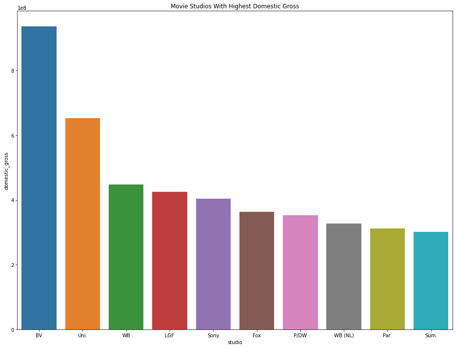
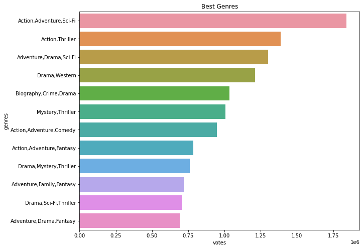

# PHASE_1 PROJECT.

## Overview

### Business Understanding.

Microsoft sees all the big companies creating original video content and they want to get in on the production. They have decided to create a new movie studio, but they don’t know anything about creating movies. I am charged with exploring what types of films that are currently doing the best at the box office. I will then translate those findings into actionable insights that the head of Microsoft's new movie studio can use to help decide what type of films to create.

Film production is a very expensive venture but it can be very profitable when the movie produced entices the targeted audience. You may find that certain kind of genres in films are more preferred to others. Some films may be exciting to the audience but due to their runtime length of minutes they may dislike them. This project aims to explore the kind of movies that are doing well at the box office, and recommend those types of films to the head of Microsoft's new movie studio. We will also explore the current best movie studios from where we can draw our insights.

### Key Business questions.

1. Which category of films are doing the best at the box office?
2. Which movie studio earns the highest gross income?
3. Is there any relationship between genres and the number of votes?

### Data understanding and Analysis.
For this project we will work with two sets of data;

The movie gross data in the path (http://localhost:8888/edit/data/bom.movie_gross.csv) Each record (row) in this dataset represents information about a film including the title, studio, domestic gross, foreign gross and the year it was produced. Each feature (column) in this dataset is some attribute of that film. You can view the file in this repository for a full explanation of all variables in this dataset.
A database data im.db in the path (http://localhost:8888/edit/data/im.db) this database contain the following 8 tables
Table Names

movie_basics
directors
known_for
movie_akas
movie_ratings
persons
principals
writers
for this project we will work with movie basics table and the movie rating tables to help fulfil our objectives for the study.

Each of the following three datasets will help us draw valuable insights and satisfy our objectives.

### Visualization.
http://localhost:8888/view/download.png
.png)

### Conclusion.
From the study we can conclude that:
1. The best studio to work with for production and enhancement of our studio
    is BV. This studio has the highest gross income.

 2. The recommended genres of the film to produce is Action, Adventure. Sci_Fi.
    As it has the highest number of votes meaning most people tends to like it.

 3. Recommend to produce a film with runtime of about 148.0 as films of 
    this length have the highest number of votes.

